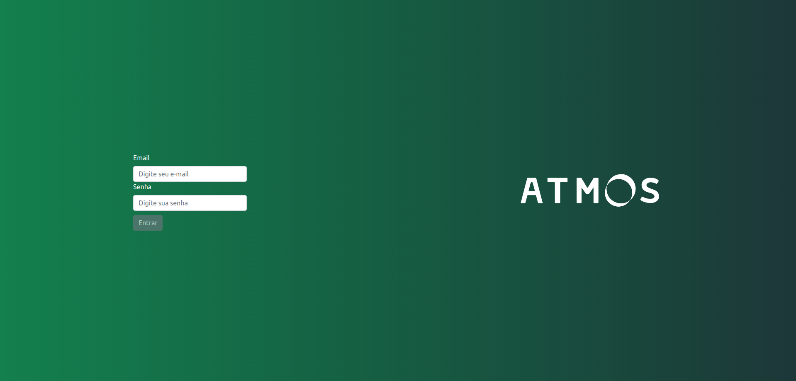
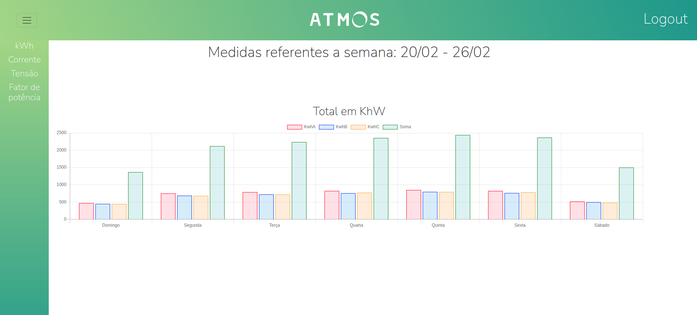

# :electric_plug: Projeto react de medições elétricas

## :rocket: Tecnologias

Esse projeto foi desenvolvido com as seguintes tecnologias:
* Javascript / React
* CSS / Reactstrap
* Redux
* ChartJS / React-ChartJS 2

## :computer: Projeto

Esse projeto foi desenvolvido para um desafio proposto de front-end onde foi criado uma tela simulada de um Login e uma página Home onde é mostrado gráficos pertinentes as medições (Tensão, Corrente, Fator de potência, kWh) de uma instalação elétrica por o período de uma semana, disponibilizados em um arquivo JSON.

A tela de **Login** possui uma simulação de uma validador, e como não possui tela de cadastro, segue as seguintes regras:
* O login valida se o e-mail possui o padrão **email@email.com**, fora desse padrão não é possível logar
* O login valida se a senha possui 6 ou mais caracteres, fora desse padrão não é possível logar
* O botão só fica habilitado caso ambos passarem na validação

**Nota: Pode ser qualquer e-mail e senha, como não tem cadastro, você vai ser redirecionado para home de toda forma, só lembre-se de seguir as regras acima**

A tela de **Home** possui um Header, uma Nav Bar lateral e os gráficos:
* O Header possui a logo, um toggle para abrir a Nav Bar e um botão para logout, onde o usuário é redirecionado para tela de Login
* Ao clicar no toggle do Header, abre-se uma Nav Bar lateral, onde é possível escolher as medições que ao clicadas, mostra o gráfico pertinente aquela medição

**Nota: Por padrão o gráfico mostrado é do kWh**

## :bar_chart: Deploy

Se quiser testar o deploy, o projeto está disponível através desse link: [Link do Projeto](https://project-atmos.vercel.app/).

## :gear: Setup

Caso queira testar esse projeto localmente, siga os seguintes passos:
* Faça o download do projeto ou clone através do comando `git clone :HttpOuSSH` 
* Instale as dependências na raiz do projeto com o comando `npm install`
* Use o comando `npm start` para abrir o projeto, vai estar disponivel em **localhost:3000**

## :framed_picture: Imagens

